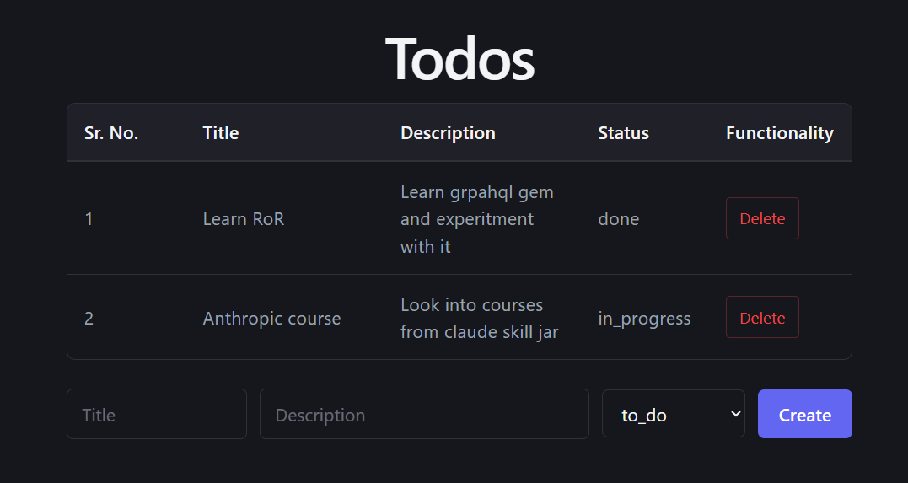

### Notes 

To above to-do app was built using following logic

1. App was setup using react + vite + ts
2. Schema was pulled from backend via `coe-to-do-fe\codegen.ts` | `npm run codegen` for typesafe logic
3. Tests were done using `vitest` , `msw` and `RTL (React Testing Library)`

#### React and Graphql architecture

1. Functional components , React hooks where explored on `coe-to-do-fe\src\components\todos\TodoList.tsx` , `coe-to-do-fe\src\components\todos\CreateTodo.tsx`
2. Graphql queries and mutation queries were written on `coe-to-do-fe\src\components\todos\queries.ts`
3. Loading and error states are handled on `coe-to-do-fe\src\components\todos\TodoList.tsx`

#### Testing architecture

1. Setup apollo client for testing on `coe-to-do-fe\src\apolloClient.ts`
2. Used `msw` write mocks for apollo queries on `coe-to-do-fe\src\mocks\handlers.ts`

